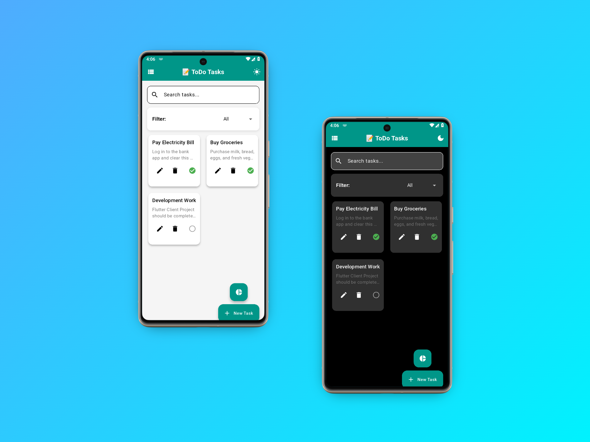
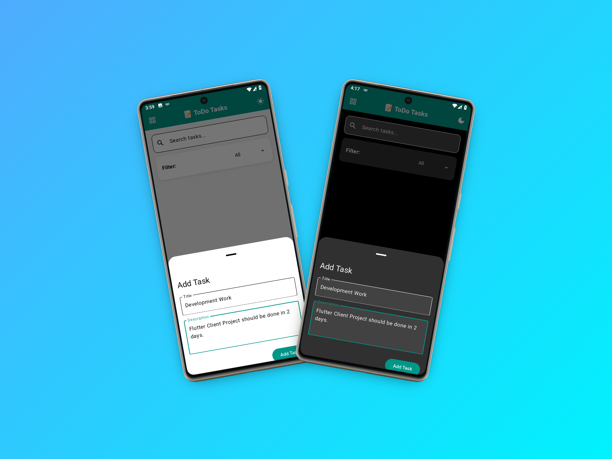
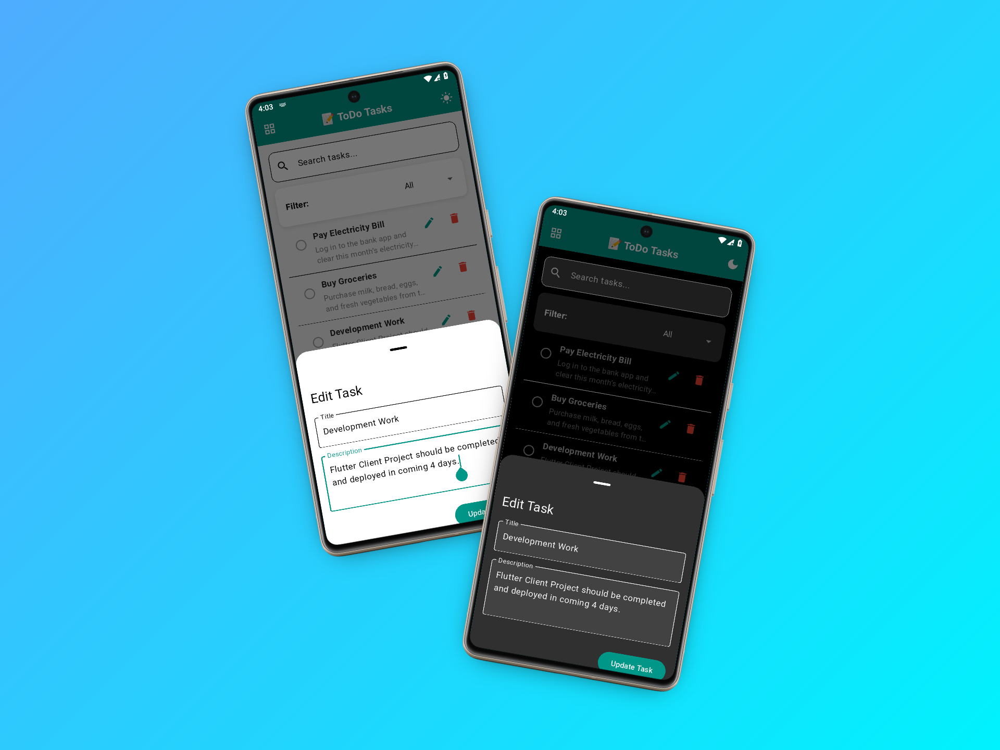
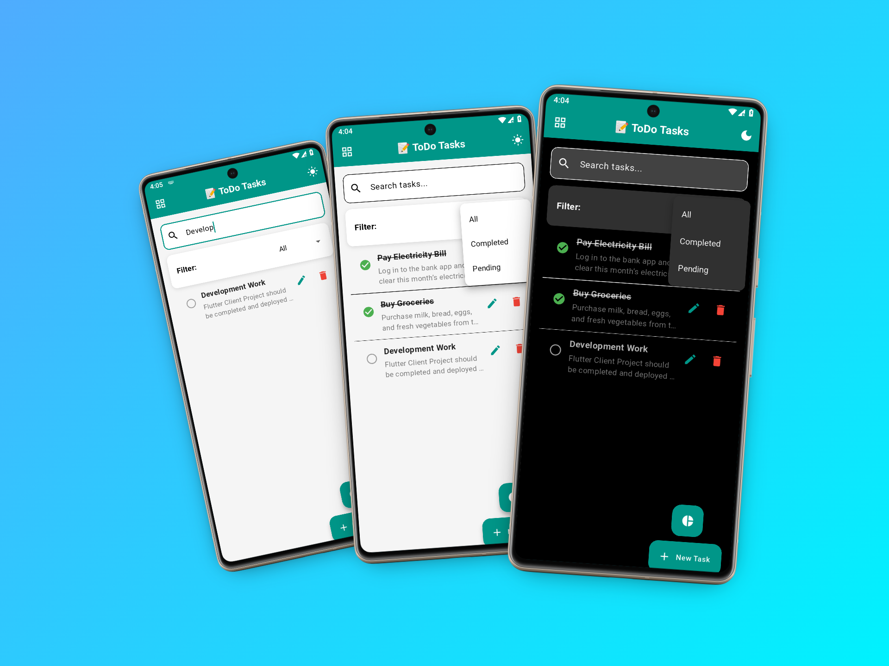
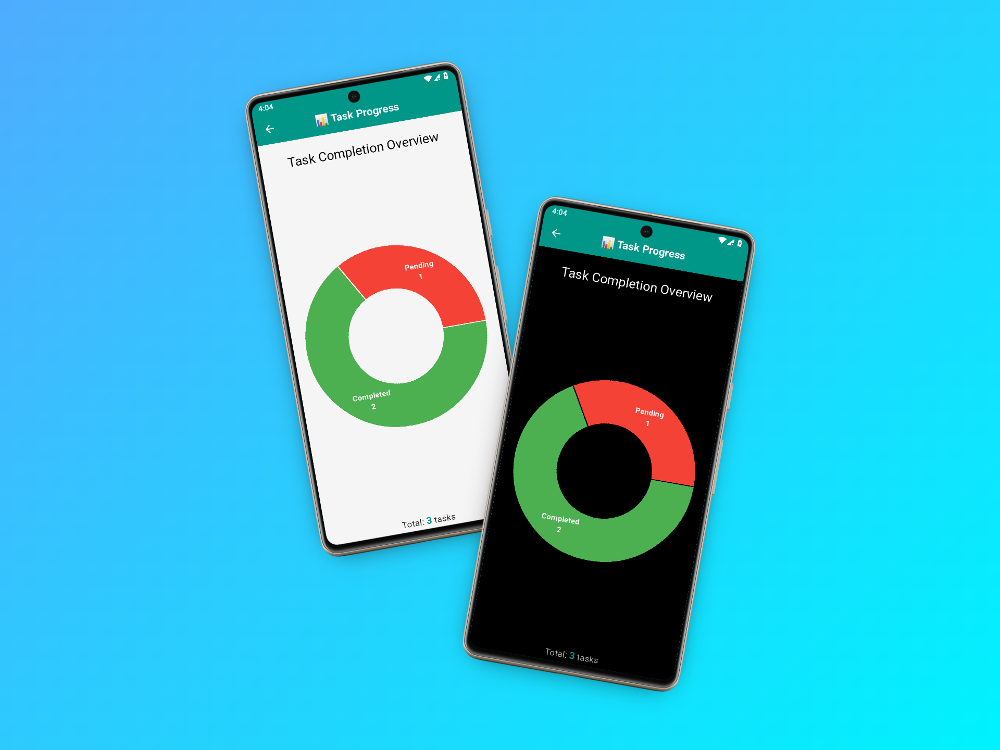

<h1>📝 Local_DB_App – Smart Offline Task Manager</h1>

A modern, offline-first task management app built with <strong>Flutter</strong> that uses <strong>Sqflite</strong> to store and manage data locally.  
<strong>Local_DB_App</strong> lets you create, edit, delete, search, filter, and track your tasks without an internet connection — complete with light/dark mode and a visual progress chart.

<h2>🚀 Features</h2>
<ul>
  <li>💾 <strong>Offline Storage</strong> using Sqflite</li>
  <li>📋 <strong>Full CRUD Support</strong> – Add, Edit, Delete tasks</li>
  <li>✅ <strong>Task Completion Status</strong>
    <ul>
      <li>When a task is created, it's <em>Pending</em> by default</li>
      <li>Tap to mark as <em>Completed</em></li>
    </ul>
  </li>
  <li>🔄 <strong>Toggle View Modes</strong> – Switch between ListView & GridView on the Home Screen</li>
  <li>🔍 <strong>Search & Filter</strong>
    <ul>
      <li>Filter by: <em>All</em>, <em>Completed</em>, <em>Pending</em></li>
      <li>Search tasks by keywords</li>
    </ul>
  </li>
  <li>🌗 <strong>Light & Dark Mode</strong> Support</li>
  <li>📊 <strong>Task Progress Screen</strong> – Visual chart showing Pending vs Completed tasks</li>
  <li>🎯 Built with <strong>MVVM architecture</strong></li>
</ul>

<h2>📱 App Screens – Local_DB_App UI Mockups</h2>

<blockquote>
 Offline productivity meets beautiful design — experience the <strong>Local_DB_App</strong>.
</blockquote>

<table width="100%" align="center" cellspacing="10">
  <tr>
    <td align="center" valign="top" style="border: 1px solid #ccc; padding: 15px;">
       
      <strong>🚀 Splash + Home (Light/Dark)</strong> 
      Splash screen and Home screen mockups in both light and dark modes.
    </td>
    <td align="center" valign="top" style="border: 1px solid #ccc; padding: 15px;">
       
      <strong>📋 List & Grid View</strong> 
      Switch between List and Grid layouts for your tasks instantly.
    </td>
  </tr>
  <tr>
    <td align="center" valign="top" style="border: 1px solid #ccc; padding: 15px;">
       
      <strong>➕ Add Task (Light/Dark)</strong> 
      Create new tasks with title, description, and category — light and dark mode supported.
    </td>
    <td align="center" valign="top" style="border: 1px solid #ccc; padding: 15px;">
       
      <strong>✏️ Edit Task (Light/Dark)</strong> 
      Update task details easily with a clean UI for both modes.
    </td>
  </tr>
  <tr>
    <td align="center" valign="top" style="border: 1px solid #ccc; padding: 15px;">
       
      <strong>🔍 Search & Filter (Light/Dark)</strong> 
      Find tasks quickly and filter between All, Completed, and Pending with a smooth interface.
    </td>
    <td align="center" valign="top" style="border: 1px solid #ccc; padding: 15px;">
       
      <strong>📊 Task Progress Chart</strong> 
      View pending and completed tasks in a circular chart powered by <strong>fl_chart</strong>.
    </td>
  </tr>
</table>

  <i>🌟 Stay organized — manage your tasks offline with Local_DB_App.</i>

<h2>📦 Tech Stack</h2>

<ul>
  <li><strong>Flutter</strong> – UI development</li>
  <li><strong>Dart</strong> – Programming language</li>
  <li><strong>Sqflite</strong> – Local database</li>
  <li><strong>Path & Path Provider</strong> – File system paths for database</li>
  <li><strong>Provider</strong> – State management</li>
  <li><strong>Shared Preferences</strong> – Save theme preference (Light/Dark)</li>
  <li><strong>fl_chart</strong> – Circular chart for task progress</li>
  <li><strong>VS Code</strong> – Development environment</li>
</ul>

<h2>📂 Folder Structure (Core)</h2>

<!-- # local_db_app

A new Flutter project.

## Getting Started

This project is a starting point for a Flutter application.

A few resources to get you started if this is your first Flutter project:

- [Lab: Write your first Flutter app](https://docs.flutter.dev/get-started/codelab)
- [Cookbook: Useful Flutter samples](https://docs.flutter.dev/cookbook)

For help getting started with Flutter development, view the
[online documentation](https://docs.flutter.dev/), which offers tutorials,
samples, guidance on mobile development, and a full API reference. -->
